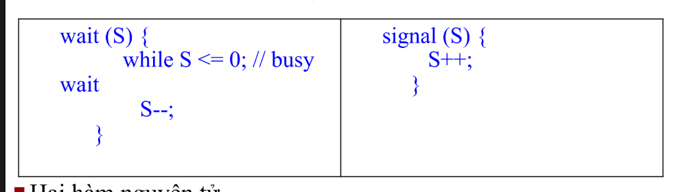

**Semaphore**  

Semaphore, được đề xuất bởi Edsger Dijkstra, là một kỹ thuật quản lý các tiến trình đồng thời bằng cách sử dụng một giá trị số nguyên đơn giản, được gọi là semaphore.  

Semaphore đơn giản là một biến không âm và được chia sẻ giữa các luồng. Biến này được sử dụng để giải quyết vấn đề vùng găng (critical section) và đạt được sự đồng bộ hóa tiến trình trong môi trường đa xử lý.  

Một semaphore \( S \) là một biến số nguyên, ngoài việc khởi tạo, chỉ được truy cập thông qua hai thao tác nguyên tử tiêu chuẩn: **wait()** và **signal()**.  

- **wait()**  
  → **P** *(từ tiếng Hà Lan "proberen", nghĩa là "kiểm tra")*  

- **signal()**  
  → **V** *(từ tiếng Hà Lan "verhogen", nghĩa là "tăng lên")*

phép toán wait và signal là 2 phép toans atomic (phep toan nguyen tu) khong the phan nho hon duoc nua

cac kieu symaphore:
binary symaphore:
symaphore nhị phân: 